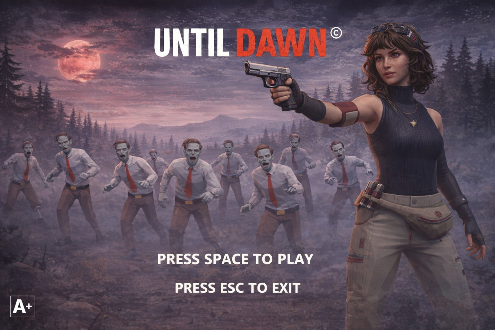

# Until Dawn - CMP3060 Graphics Project

You are the last line between survival and the undead. The silence is broken only by distant growls… and they’re getting closer. As the night unfolds, waves of relentless zombies emerge from the shadows: faster, stronger and more aggressive with every passing moment. There is no escape. No rescue. Only your instincts, your weapons and them.

## Features

- Forward rendering pipeline with opaque/transparent sorting, sky rendering, and post-processing.
- ECS-based scene organization (entities, components, systems).
- Config-driven scenes and tests via JSONC in the `config` folder.
- In-engine HUD overlays (crosshair + health bar).

## Graphics and Rendering

- Shader-driven materials (tinted, textured, and lit variants).
- Mesh and texture loading with configurable samplers.
- Sky sphere rendering and full-screen post-processing passes.
- Multiple light support in the forward renderer (up to a fixed max).
- Optional skinned rendering path for animated characters.

## Collision and Gameplay

- AABB collider component with trigger support.
- Collision system with current/started/ended collision tracking.
- Raycast utilities for hit detection (e.g., shooting).

## Lighting

- Scene light components collected per frame by the forward renderer.
- Per-material lighting support via `LitMaterial` shaders.

## Audio System

- OpenAL-based audio manager with WAV loading.
- Looping ambient tracks and one-shot SFX.
- Runtime toggles for music and effects.

## Character Animation

- Motion clip system with sampling and skinning matrices.
- Zombie animation system with clip overrides, pose tuning, and death effects.
- Optional bone attachments for weapons and VFX.

## Build and Run (CMake)

### Requirements

- CMake 3.16+ (recommended)
- C++17 compiler (GCC 9+, Clang 5+, or MSVC 2017+)

### Configure and Build

```bash
cmake -S . -B build
cmake --build build
```

### Run

On Linux/macOS:

```bash
./bin/GAME_APPLICATION
```

On Windows:

```bat
./bin/GAME_APPLICATION.exe
```

### Run with a specific config

```bash
./bin/GAME_APPLICATION -c='config/app.jsonc'
```

## Gameplay

[](https://youtu.be/qZC47AnXaIw)

Watch the demo: https://youtu.be/qZC47AnXaIw
